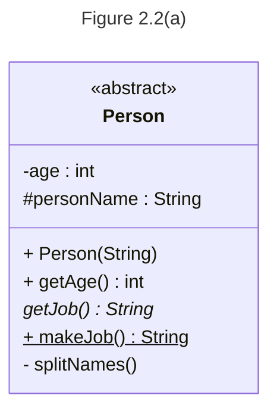
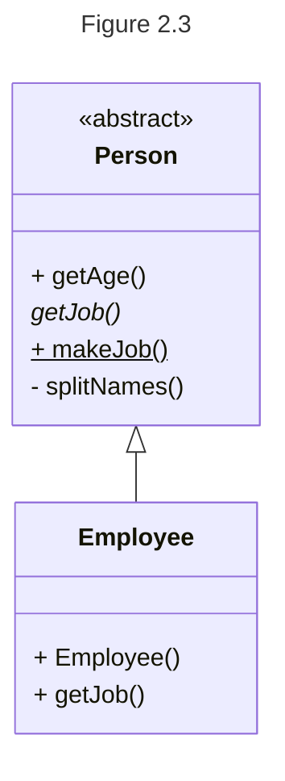
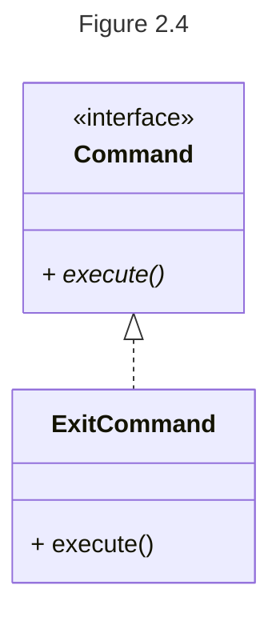
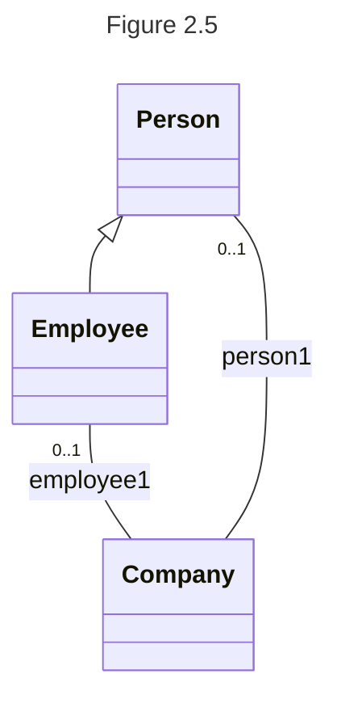
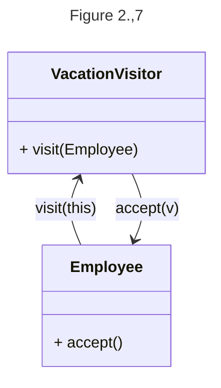

# UML Diagrams
## Syntax
The book uses UML diagrams formatted a particular way. In order to recreate the look of the Book's UML,
the following table shows the equivalent syntax for recreating that UML with Mermaid.

| Concept                         |             Java              |                          Book UML                           |                            Mermaid                  |
|:--------------------------------|:-----------------------------:|:-----------------------------------------------------------:|:---------------------------------------------------:|
| abstract class                  |          `abstract`           |                     _Person_ (italics)                      |                  `<<abstract>>` (annotation)        |
| abstract method                 |          `abstract`           |                    _getJob()_ (italics)                     |                     `getJob()*` (asterisk)          |
| static method                   |           `static`            |              <ins>makeJob()</ins> (underline)               |                   `makeJob()$` (dollar sign)        |
| public field or method          |           `public`            |                             `+`                             |                              `+`                    |
| protected field or method       |          `protected`          |                             `#`                             |                              `#`                    |
| package private field or method |            nothing            |                           nothing                           |                         nothing or `~`              |
| private field or method         |           `private`           |                             `-`                             |                              `-`                    |
| field type                      |           `int age`           |                         `age: int`                          |                `age : int` (space before colon)     |
| method return type              |        `int getAge()`         |                       `getAge(): int`                       |                   `getAge() int` (no colon)         |
| inheritance from a class        |           `extends`           |             solid line, hollow triangular arrow             |                            `<\|--`                  |
| inheritance from an interface   |         `implements`          |            dashed Line, hollow triangular arrow             |                            `<\|..`                  |
| composition                     |  presence of an object field  |     solid line, no arrow, cardinality, field name label     | `ClassWhichIsHad "cardinality" -- ClassWhichHas : nameOfField` |
| method calls                    | `calledObject.calledMethod()` | solid line, filled triangular arrow, method call annotation |    `CalledClass <-- CallingClass : method(arg)`     |

## Class
The following UML diagram describes the following Java class.

```java
public abstract class Person {
    
    protected String personName;
    private int age;
    
    public Person(String name) {
        personName = name;
    }
    
    public static String makeJob() { return "hired"; }
    
    public int getAge() { return age; }
    
    private void splitNames() {}
    
    abstract String getJob();
    
}
```

## Inheritance
### Class

### Interface


## Composition
The following: 

describes:
```java
public class Company {
    Employee employee1;
    Person person1;
    public Company() {}
}
```
## Method Calls
